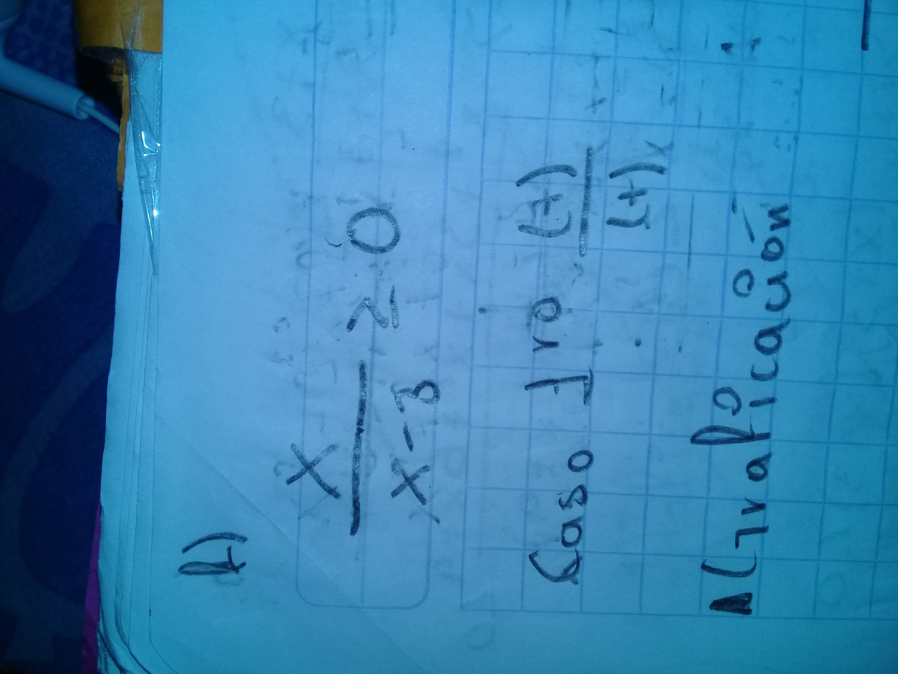
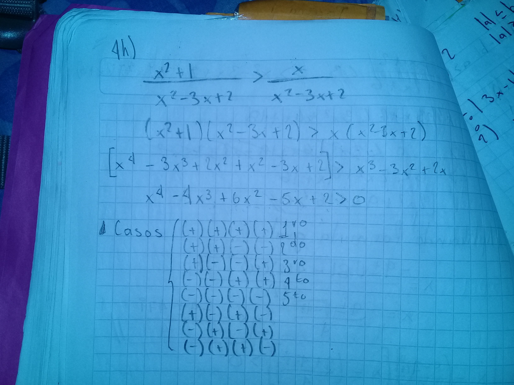
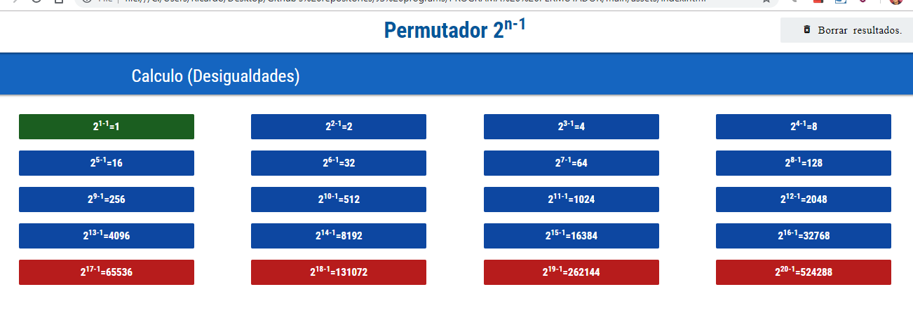
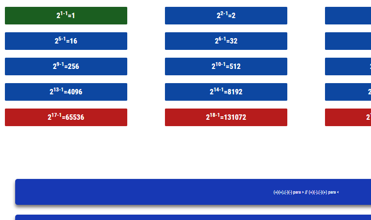

# Permutador para Casos en desigualdades. (+)(-)(+)(-)

> Probablemente te haz encontrado en la necesidad de encontrar los casos para los diversos problemas en las desigualdades... Teniendo que en ocasiones encontrar las diversas combinaciones de signos de manera <b>Aleatoria</b>, lo cual sin duda es muy frustrante.
>
> Ejemplo.
>
> (+)(+) / (-)(+) / (+)(-) / (-)(-)... etc

### Ejemplos de desigualdades que requieren conocer los casos a emplear.

### Uso

* Accede a index.html el cual se encuentra en la carpeta main

* Solo presiona los botones dependiendo del grado de la ecuación que tengas en tu  desigualdad y obtendras los casos dependiendo de hacia donde apunte esta (< ó >).

  >  <b>Los botones en rojo son procesos muy lentos y podrian trabar el programa, por la gran cantidad de combinaciones</b>

  

###### Realizado en colaboración con la colaboración del Dr. Encarnación Salinas , profesor de la Escuela Superior de Cómputo. (2018).

